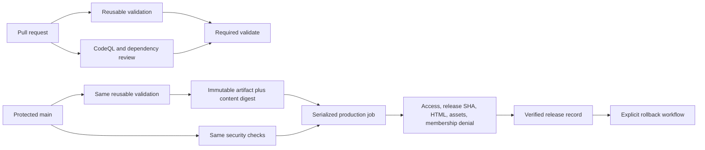

# Launcher releases and recovery

The launcher is a Cloudflare Worker built with vinext. The current configured Worker is `slice-launcher`, with membership data in D1. Cloudflare Access verifies identity at the perimeter; application authorization remains responsible for current membership and permissions.

## Pipeline



The exact job name `validate` remains the branch protection context. It runs even when prerequisites fail or skip and fails unless every expected job succeeded. PR validation receives no production or model secrets. It runs formatting, architecture/lint checks, TypeScript, unit/integration tests, critical-module coverage, migration tests, synthetic browser tests, production build, and a local Worker smoke check. Browser diagnostics contain synthetic identities and are retained for seven days on failures.

Release validation builds once with `SLICE_RELEASE_SHA` embedded in the health endpoint. It inspects every deployable file for synthetic harness markers, forbidden environment files, and symlinks, then records SHA-256 file hashes and a combined content digest. GitHub stores the immutable release artifact for 30 days. The production job downloads the exact artifact ID from its own validation job and compares its source, files, and digest against the separate validation output before invoking the locked Wrangler version with `--no-bundle`. It does not rebuild.

The release workflow repeats the shared checks on main. This is deliberate: a merge commit may differ from the PR's checked merge candidate. The reusable definition prevents PR and release checks from drifting; their executions and artifacts are distinct.

## Production configuration

Retain the protected GitHub `production` environment, restrict it to protected main, and keep these secrets there:

- `CLOUDFLARE_ACCOUNT_ID`
- `CLOUDFLARE_API_TOKEN`, scoped to the intended account and Worker with the permissions needed by deploy, deployment status, and rollback.
- `CF_ACCESS_CLIENT_ID` and `CF_ACCESS_CLIENT_SECRET`, for the dedicated CI service identity.

Repository variable `SLICE_LAUNCHER_URL` identifies the protected production origin. `SLICE_LAUNCHER_DEPLOY_ENABLED=true` enables forward deployment. The expected Access team domain is explicitly pinned in both production workflows and must be changed together with a reviewed account/domain migration. No production settings are changed by these files alone.

Both deploy and rollback share `slice-launcher-production` concurrency, preserve queued jobs, and do not cancel an in-flight production change. Immediately before forward deployment, the job checks whether its commit is still main; superseded commits skip upload. A main update during deployment is handled by the next queued release. Manual rollback intentionally restores the operator-selected prior release even if it is not current main; operators should pause forward deployment during incident recovery when a queued new release would supersede recovery.

Dependencies install without lifecycle scripts in production jobs. Production credentials are available only to the actual deployment/recovery step, not installation, artifact download, or contributor validation.

## Verification and provenance

Health returns `{ "status": "ok", "release": "<40-character source SHA>" }` with `Cache-Control: no-store`. Local development defaults to `development`. Production verification requires:

1. Requests without credentials to the launcher and membership API redirect to the configured Cloudflare Access login.
2. The CI service credential receives HTTP 401 and JSON with no-store from membership, both before and after checking the intended release.
3. Health serves the intended source SHA, and the launcher HTML and its CSS/JavaScript assets load from the same origin.
4. Wrangler reports the uploaded Worker version serving 100 percent of traffic.

Only explicit transient health statuses (404/502/503/504), local startup connection refusal, and an old health release identity retry for up to 30 seconds. PR #10's bounded membership-route 404 propagation retry remains. Other authentication responses, exposed membership data, malformed responses, bad assets, or an absent Access boundary fail immediately. Credentials never follow redirects or leave the launcher origin.

After all verification succeeds, the workflow stores `verified-release.json`, the manifest, and deployment status for 90 days. Together they link source SHA, GitHub run, immutable artifact ID/service digest, content digest, Worker version, deployment ID, and verification time. Failed smoke checks remain failed runs and cannot create verified provenance. GitHub Actions job failures are the notification mechanism; no external messaging integration is used.

Local verification, using the project's Node/pnpm environment:

```sh
SLICE_RELEASE_SHA=$(git rev-parse HEAD) pnpm build
SLICE_RELEASE_SHA=$(git rev-parse HEAD) pnpm smoke:launcher
node --test scripts/check-launcher.test.mjs scripts/release.test.mjs
```

Synthetic application tests do not establish real Google/Access authentication. Production verification requires actual credentials and the deployed perimeter.

## Explicit rollback

Use **Actions → Roll back launcher → Run workflow**, select `main`, supply the successful **Deploy launcher** run ID for the desired previously verified release, and give a non-sensitive reason. Before execution, review the selected release's migration compatibility and the current incident.

The workflow validates run metadata before downloading any artifact. It downloads the exact named provenance artifact into an isolated runner temporary directory, never over the trusted checkout. It then accepts only the three expected bounded ordinary JSON files, rejects symlinks and extra entries, and cross-checks their source and deployed version. It rejects failed/in-progress runs, other workflows, non-main branches, PR events, source mismatches, unverified records, malformed digests, and invalid Worker/deployment IDs. No arbitrary Worker version input is accepted. It invokes `wrangler rollback <verified-version> --name slice-launcher --message <reason>`, verifies the original source SHA and security checks again, and confirms that version has 100 percent traffic. Successful recovery evidence is retained for 90 days.

There is no automatic rollback. A failed rollback verification remains failed and requires investigation. Artifact expiration/deletion or Cloudflare version/resource limitations can prevent rollback. Keep a suitable verified record before retiring old releases; do not forge a record for a pre-pipeline version. Until the first release under this pipeline passes, this workflow has no eligible target.

Worker rollback does **not** restore D1 data or undo migrations. Follow [the migration policy](migrations.md). Rollback mechanics are tested with local artifact and API-response fixtures; an actual Cloudflare deployment and recovery exercise requires approval and has not been run by this implementation.

Official command references: [Wrangler Worker commands](https://developers.cloudflare.com/workers/wrangler/commands/workers/) and [rollback limitations](https://developers.cloudflare.com/workers/versions-and-deployments/rollbacks/). Command flags and deployment JSON shape were checked against this repository's installed Wrangler.

## Ownership transition

When Slice takes ownership, migrate repository/environment administration, account-scoped credentials, target Worker/D1 bindings, hostname, and Access policy together. Verify identity, current membership authorization, and rollback eligibility before enabling automated releases in the new account. Account membership is not application membership.
